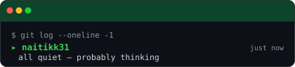

<!--
  naitikk31/naitikk31 — profile README
  Generated assets: portrait (dotify.py), banner (banner.py),
  radars (radar.py), cards (cards.py), status (status.py)
  Automated: .github/workflows/{metrics,radar,snake,status}.yml
-->

<!-- ═══════════════════════════════════════════════════════ HERO ══ -->
<div align="center">

<table cellpadding="0" cellspacing="0" border="0">
<tr>
<td width="38%" align="center" valign="middle">

<!-- PORTRAIT — dot-matrix SVG generated by scripts/dotify.py
     Regenerate: python scripts/dotify.py assets/photo.jpg -o assets/portrait \
       --cols 100 --equalize --detail 0.5 --color --reveal -->


</td>
<td width="62%" align="center" valign="middle">

<!-- BANNER — dot-matrix name generated by scripts/banner.py
     Same circle primitives as the portrait. Regenerate: python scripts/banner.py -->


<br><br>

<!-- SOCIALS -->
<a href="https://github.com/naitikk31"></a>
&nbsp;
<a href="https://www.linkedin.com/in/naitikdarji/"></a>
&nbsp;
<a href="mailto:darjinaitik7@gmail.com"></a>
&nbsp;
<a href="https://leetcode.com/u/naitikkk31/"></a>
&nbsp;
<a href="https://codeforces.com/profile/naitikkk31"></a>

<br><br>


</td>
</tr>
</table>

</div>

<!-- ════════════════════════════════════════════════════ DIVIDER ══ -->
<picture>
  <source media="(prefers-color-scheme: dark)"  srcset="assets/divider-dark.svg">
  <source media="(prefers-color-scheme: light)" srcset="assets/divider-light.svg">
  
</picture>

<!-- ══════════════════════════════════════════════════ ABOUT ME ══ -->

## `~/` whoami

```console
$ cat about.txt
```

Most of my projects exist because a real problem was annoying enough to fix.
**TailorTrack** started as a notebook my father used to track his tailoring business — I turned it into a React + Firebase dashboard with actual analytics.
The **3D Load Visualizer** came from staring at raw three-phase electrical data and thinking there has to be a way to *see* this.
DSA is where I go when I want to think clearly: the problem is honest, the solution is either right or wrong, and there's always a smarter approach somewhere.

- 🎓 B.Tech CSE — **IIIT Vadodara – ICD**, Year 3
- 🔭 Primary stack: **Java** for systems · **React** for the web · **C++** when speed matters
- 🌱 Currently going deep on **System Design** and advanced OOP patterns
- 🧩 Daily habit: LeetCode & Codeforces · consistency over streaks

<!-- ════════════════════════════════════════════════════ DIVIDER ══ -->
<picture>
  <source media="(prefers-color-scheme: dark)"  srcset="assets/divider-dark.svg">
  <source media="(prefers-color-scheme: light)" srcset="assets/divider-light.svg">
  
</picture>

<!-- ════════════════════════════════════════════════ TOOLBOX ══ -->

<div align="center">

## `~/` toolbox


</div>

<!-- ════════════════════════════════════════════════════ DIVIDER ══ -->
<picture>
  <source media="(prefers-color-scheme: dark)"  srcset="assets/divider-dark.svg">
  <source media="(prefers-color-scheme: light)" srcset="assets/divider-light.svg">
  
</picture>

<!-- ═══════════════════════════════════════════════ BENTO GRID ══ -->

<div align="center">

## `~/` the numbers

<table cellpadding="8" cellspacing="0" border="0">
<tr>
<td width="55%" align="center" valign="top">

<!-- GitHub stats card — generated by scripts/cards.py -->
<picture>
  <source media="(prefers-color-scheme: dark)"  srcset="assets/card-stats-dark.svg">
  <source media="(prefers-color-scheme: light)" srcset="assets/card-stats-light.svg">
  
</picture>

<br><br>

<!-- Last-commit status widget — generated by scripts/status.py every 3h -->
<picture>
  <source media="(prefers-color-scheme: dark)"  srcset="assets/status-dark.svg">
  <source media="(prefers-color-scheme: light)" srcset="assets/status-light.svg">
  
</picture>

</td>
<td width="45%" align="center" valign="top">

<!-- Self-rated skill radar — edit assets/skills.json to adjust -->
<picture>
  <source media="(prefers-color-scheme: dark)"  srcset="assets/radar-dark.svg">
  <source media="(prefers-color-scheme: light)" srcset="assets/radar-light.svg">
  
</picture>

<br>

<!-- Live language radar from real repo byte counts -->
<picture>
  <source media="(prefers-color-scheme: dark)"  srcset="assets/radar-langs-dark.svg">
  <source media="(prefers-color-scheme: light)" srcset="assets/radar-langs-light.svg">
  
</picture>

</td>
</tr>
</table>

</div>

<!-- ════════════════════════════════════════════════════ DIVIDER ══ -->
<picture>
  <source media="(prefers-color-scheme: dark)"  srcset="assets/divider-dark.svg">
  <source media="(prefers-color-scheme: light)" srcset="assets/divider-light.svg">
  
</picture>

<!-- ══════════════════════════════════════ CONTRIBUTION CALENDAR ══ -->

<div align="center">

## `~/` contribution calendar

<!-- 3D isometric calendar — regenerated every 6h by .github/workflows/metrics.yml -->


<br><br>

<!-- Snake eating the contribution graph — .github/workflows/snake.yml -->
<picture>
  <source media="(prefers-color-scheme: dark)"  srcset="https://raw.githubusercontent.com/naitikk31/naitikk31/output/snake-dark.svg">
  <source media="(prefers-color-scheme: light)" srcset="https://raw.githubusercontent.com/naitikk31/naitikk31/output/snake.svg">
  
</picture>

</div>

<!-- ════════════════════════════════════════════════════ DIVIDER ══ -->
<picture>
  <source media="(prefers-color-scheme: dark)"  srcset="assets/divider-dark.svg">
  <source media="(prefers-color-scheme: light)" srcset="assets/divider-light.svg">
  
</picture>

<!-- ════════════════════════════════════════════════════ FOOTER ══ -->

<div align="center">

<sub>`01110100 01101000 01100001 01101110 01101011 01110011 00100000 01100110 01101111 01110010 00100000 01110011 01100011 01110010 01101111 01101100 01101100 01101001 01101110 01100111`</sub>

</div>
