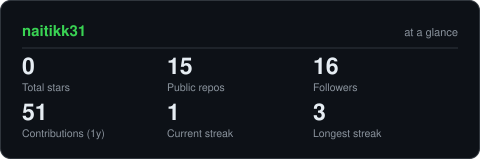
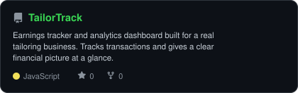
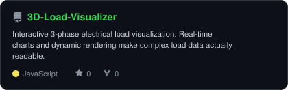
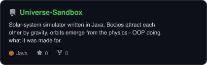
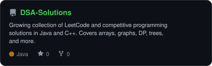

<div align="center">

<!-- PORTRAIT - generated by scripts/dotify.py from assets/photo.jpg.
     Colour mode, so one file serves both GitHub themes. Regenerate with:
       python scripts/dotify.py assets/photo.jpg -o assets/portrait \
         --cols 100 --equalize --detail 0.5 --color --reveal -->


<br>

<!-- NAME / TAGLINE - animated typing -->
<a href="https://github.com/naitikk31">
  
</a>

<br>

<!-- SOCIALS -->
<a href="https://github.com/naitikk31"></a>
<a href="YOUR_LINKEDIN"></a>
<a href="mailto:YOUR_EMAIL"></a>
<a href="YOUR_LEETCODE"></a>
<a href="YOUR_CODEFORCES"></a>
<a href="YOUR_PORTFOLIO"></a>


</div>

---

## `~/` whoami

```console
$ cat about.txt
```

Hi, I'm **Naitik Darji** — a 3rd-year Computer Science student at **IIIT Vadodara – International Campus Diu**.
I build things with Java and React, and I solve DSA problems because I enjoy the puzzle as much as the solution.

- 🎓 B.Tech CSE @ **[IIIT Vadodara – ICD](https://iiitvadodara.ac.in)**
- 🔭 Currently building **[TailorTrack](https://github.com/naitikk31/TailorTrack)** — a real business app for my father's tailoring shop
- ⚡ Also working on a **[3D Load Visualizer](https://github.com/naitikk31/3D-Load-Visualizer)** for electrical engineering data
- 🌱 Deepening my understanding of **System Design** and **OOP patterns**
- 🧩 Fun fact: I wrote a **[Universe Sandbox](https://github.com/naitikk31/Universe-Sandbox)** in Java Swing — solar systems are basically graphs with gravity

<br>

<div align="center">

## `~/` toolbox


</div>

---

<div align="center">

## `~/` skill radar

<table>
<tr>
<td width="50%" align="center" valign="middle">

<!-- Self-rated radar - edit assets/skills.json, the workflow redraws it -->
<picture>
  <source media="(prefers-color-scheme: dark)"  srcset="assets/radar-dark.svg">
  <source media="(prefers-color-scheme: light)" srcset="assets/radar-light.svg">
  
</picture>

</td>
<td width="50%" align="center" valign="middle">

<!-- Live radar built from real language byte counts across your repos -->
<picture>
  <source media="(prefers-color-scheme: dark)"  srcset="assets/radar-langs-dark.svg">
  <source media="(prefers-color-scheme: light)" srcset="assets/radar-langs-light.svg">
  
</picture>

</td>
</tr>
</table>

</div>

---

<div align="center">

## `~/` contribution calendar

<!-- 3D isometric calendar, regenerated every 6h by .github/workflows/metrics.yml -->


<br><br>

<!-- Snake eats the contribution graph - .github/workflows/snake.yml -->
<picture>
  <source media="(prefers-color-scheme: dark)"  srcset="https://raw.githubusercontent.com/naitikk31/naitikk31/output/snake-dark.svg">
  <source media="(prefers-color-scheme: light)" srcset="https://raw.githubusercontent.com/naitikk31/naitikk31/output/snake.svg">
  
</picture>

</div>

---

<div align="center">

## `~/` the numbers

<!-- Generated by scripts/cards.py into this repo. Deliberately NOT
     github-readme-stats / streak-stats / github-profile-trophy: those are
     shared public instances that go down and take the whole section with them. -->
<picture>
  <source media="(prefers-color-scheme: dark)"  srcset="assets/card-stats-dark.svg">
  <source media="(prefers-color-scheme: light)" srcset="assets/card-stats-light.svg">
  
</picture>

<br>


<br><br>


</div>

---

<div align="center">

## `~/` selected work

<!-- Cards generated by scripts/cards.py from assets/projects.json.
     Stars, forks and language are pulled live from the API on every run. -->
<table>
<tr>
<td width="50%">
  <a href="https://github.com/naitikk31/TailorTrack">
    <picture>
      <source media="(prefers-color-scheme: dark)"  srcset="assets/card-TailorTrack-dark.svg">
      <source media="(prefers-color-scheme: light)" srcset="assets/card-TailorTrack-light.svg">
      
    </picture>
  </a>
</td>
<td width="50%">
  <a href="https://github.com/naitikk31/3D-Load-Visualizer">
    <picture>
      <source media="(prefers-color-scheme: dark)"  srcset="assets/card-3D-Load-Visualizer-dark.svg">
      <source media="(prefers-color-scheme: light)" srcset="assets/card-3D-Load-Visualizer-light.svg">
      
    </picture>
  </a>
</td>
</tr>
<tr>
<td width="50%">
  <a href="https://github.com/naitikk31/Universe-Sandbox">
    <picture>
      <source media="(prefers-color-scheme: dark)"  srcset="assets/card-Universe-Sandbox-dark.svg">
      <source media="(prefers-color-scheme: light)" srcset="assets/card-Universe-Sandbox-light.svg">
      
    </picture>
  </a>
</td>
<td width="50%">
  <a href="https://github.com/naitikk31/DSA-Solutions">
    <picture>
      <source media="(prefers-color-scheme: dark)"  srcset="assets/card-DSA-Solutions-dark.svg">
      <source media="(prefers-color-scheme: light)" srcset="assets/card-DSA-Solutions-light.svg">
      
    </picture>
  </a>
</td>
</tr>
</table>

<sub>

| project | stack | what it does |
|---|---|---|
| **[TailorTrack](https://github.com/naitikk31/TailorTrack)** | `React` `Firebase` | Earnings tracker & analytics dashboard built for a real tailoring business |
| **[3D Load Visualizer](https://github.com/naitikk31/3D-Load-Visualizer)** | `React` `Chart.js` | Interactive 3-phase electrical load visualization with real-time charts |
| **[Universe Sandbox](https://github.com/naitikk31/Universe-Sandbox)** | `Java` `Swing` | Solar-system simulation — OOP-first, gravity included |
| **[DSA Solutions](https://github.com/naitikk31/DSA-Solutions)** | `Java` `C++` | Growing collection of LeetCode & competitive programming solutions |

</sub>

</div>

---

<div align="center">

<sub>`01110100 01101000 01100001 01101110 01101011 01110011 00100000 01100110 01101111 01110010 00100000 01110011 01100011 01110010 01101111 01101100 01101100 01101001 01101110 01100111`</sub>

</div>
